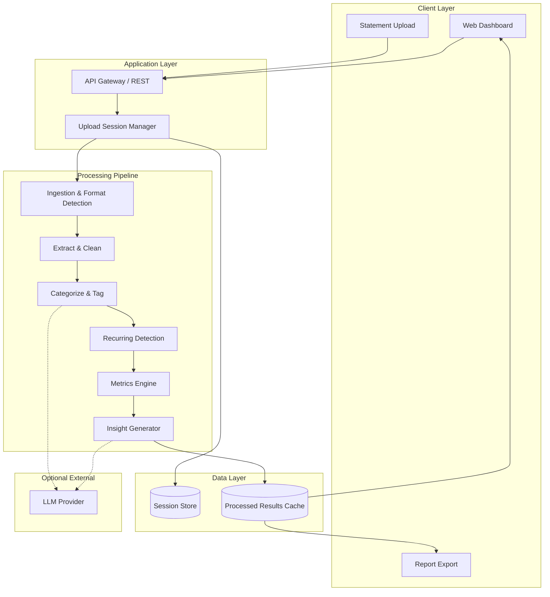
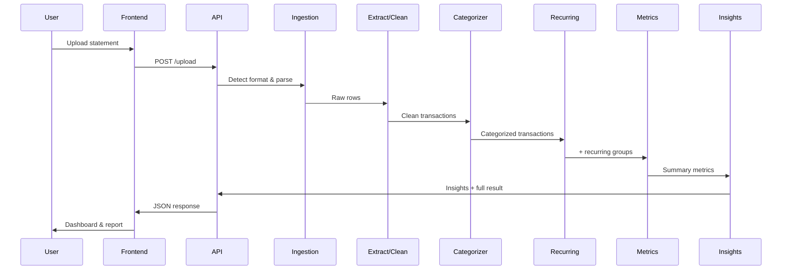
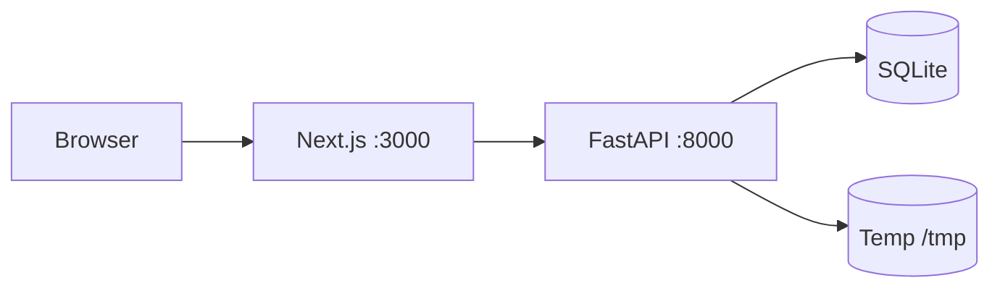
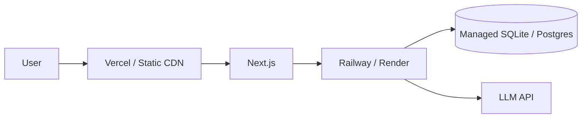

# RupeeRadar — System Architecture

This document describes the recommended architecture for RupeeRadar, an AI-powered personal finance assistant. It is derived from [context.md](./context.md) and is designed to prioritize a **working end-to-end prototype** while remaining extensible.

---

## 1. Architecture Goals

| Goal | How the architecture supports it |
|------|----------------------------------|
| End-to-end workflow | Single pipeline from upload → insights → dashboard/report |
| Messy real-world data | Layered parsing (format detection → normalization → AI cleanup) |
| Accurate categorization | Hybrid rules + AI with confidence scores and manual override |
| Useful insights | Metrics engine + templated/LLM insight generation on real amounts |
| Privacy | Local-first option, no long-term storage of raw statements by default |
| Demo-ready prototype | Monorepo or simple two-tier app, one primary bank/CSV format first |

---

## 2. High-Level System View



**Request lifecycle (synchronous for prototype):**

1. User uploads a bank statement (CSV, Excel, or PDF).
2. API creates a short-lived **analysis session**.
3. Pipeline runs sequentially; progress can be polled or shown as a loading state.
4. Structured results are stored in session cache and rendered in the dashboard.
5. User exports a PDF/HTML summary or shares a read-only snapshot (optional).

---

## 3. Recommended Technology Stack

Stack is flexible per project constraints; this is a pragmatic default for the AI Challenge prototype.

| Layer | Recommended | Rationale |
|-------|-------------|-----------|
| Frontend | **Next.js (React) + Tailwind + Recharts** | Fast dashboard UI, SSR optional, good chart library |
| Backend | **Python FastAPI** | Strong ecosystem for CSV/PDF parsing and AI integration |
| Parsing | **pandas**, **openpyxl**, **pdfplumber** / **tabula** | Common statement formats |
| AI | **OpenAI / Gemini API** or local **Ollama** | Categorization and insight wording |
| Storage | **SQLite** (session metadata) + **in-memory / temp files** for statements | Simple, local, privacy-friendly |
| Report | **WeasyPrint** or **react-pdf** | HTML → PDF export |
| Deployment | **Docker Compose** (local) or **Vercel + Railway/Render** | Runnable demo with minimal ops |

---

## 4. Component Architecture

### 4.1 Client Layer (Dashboard)

**Responsibilities**

- Upload bank statements (drag-and-drop, file picker).
- Display processing status and errors.
- Render spend summary, category breakdown, recurring payments, and insights.
- Allow category correction (feeds back into rules cache for the session).
- Export or share final report.

**Suggested pages / views**

| View | Content |
|------|---------|
| Upload | File input, format hints, privacy notice |
| Overview | Total income, spend, savings, period selector |
| Categories | Pie/bar chart, top categories table |
| Transactions | Searchable, filterable cleaned transaction list |
| Recurring | Subscriptions, EMIs, rent, SIPs with monthly totals |
| Insights | ≥3 personalized insight cards |
| Report | Print-friendly layout + download |

### 4.2 API Layer

**Responsibilities**

- Authenticate sessions (optional for prototype; use anonymous session IDs).
- Validate uploads (size, type, virus scan optional).
- Orchestrate the processing pipeline.
- Serve aggregated results and transaction lists (paginated).

**Core endpoints (REST)**

```
POST   /api/v1/sessions                    Create analysis session
POST   /api/v1/sessions/{id}/upload        Upload statement file
POST   /api/v1/sessions/{id}/analyze       Run full pipeline
GET    /api/v1/sessions/{id}/status        Processing status
GET    /api/v1/sessions/{id}/summary         Income, spend, savings, period
GET    /api/v1/sessions/{id}/categories      Category aggregates
GET    /api/v1/sessions/{id}/transactions    Paginated cleaned transactions
GET    /api/v1/sessions/{id}/recurring       Detected recurring items
GET    /api/v1/sessions/{id}/insights        Generated insights
PATCH  /api/v1/sessions/{id}/transactions/{txId}  User category override
GET    /api/v1/sessions/{id}/report          PDF or HTML report
DELETE /api/v1/sessions/{id}                 Purge session data
```

### 4.3 Ingestion & Format Detection

**Input formats (prototype priority)**

1. **CSV** — Primary target; map columns via heuristics or user mapping UI.
2. **Excel (.xlsx)** — Same as CSV after sheet detection.
3. **PDF** — Secondary; bank-specific template or table extraction.

**Format detection logic**

- Inspect file extension and MIME type.
- For CSV/Excel: sniff delimiter, header row, date/amount column names.
- For PDF: detect bank template keywords (e.g., "HDFC", "ICICI", "SBI") or fall back to generic table extraction.
- If ambiguous, prompt user to confirm column mapping (date, description, debit, credit, balance).

**Output:** Raw row set + detected schema metadata.

### 4.4 Extract & Clean Module

Transforms raw rows into a canonical **Transaction** model.

**Cleaning steps**

| Step | Action |
|------|--------|
| Date parsing | Normalize to `YYYY-MM-DD`; handle `DD-MM-YYYY`, `DD/MM/YY`, etc. |
| Amount normalization | Single signed `amount` (+ credit/income, − debit/expense) |
| Description cleanup | Trim whitespace, collapse spaces, remove reference noise |
| Deduplication | Hash on `(date, amount, normalized_description)` |
| Type inference | `credit` vs `debit` from columns or sign |
| Invalid row handling | Skip or flag rows missing date/amount |

**Merchant extraction (optional enrichment)**

- Strip UPI IDs, IMPS refs, card masked numbers.
- Extract merchant token: e.g., `UPI-SWIGGY-123` → `Swiggy`.

### 4.5 Categorization Module

**Hybrid strategy (recommended)**

```
                    ┌─────────────────┐
                    │  Transaction    │
                    └────────┬────────┘
                             │
              ┌──────────────▼──────────────┐
              │   Rule-based matcher        │
              │   (keywords, regex, MCC)    │
              └──────────────┬──────────────┘
                             │ no match / low confidence
              ┌──────────────▼──────────────┐
              │   LLM batch categorizer     │
              │   (description + amount)    │
              └──────────────┬──────────────┘
                             │
              ┌──────────────▼──────────────┐
              │   Category + confidence     │
              └─────────────────────────────┘
```

**Categories (fixed enum per context.md)**

`Food` · `Travel` · `Shopping` · `Bills` · `EMI` · `Subscriptions` · `Salary` · `Rent` · `Investments` · `Other`

**Rule examples**

| Pattern | Category |
|---------|----------|
| SWIGGY, ZOMATO, DOMINOS | Food |
| IRCTC, MAKEMYTRIP, UBER | Travel |
| AMAZON, FLIPKART, MYNTRA | Shopping |
| ELECTRICITY, JIO, AIRTEL | Bills |
| NETFLIX, SPOTIFY, YOUTUBE | Subscriptions |
| NACH, EMI, LOAN | EMI |
| SALARY, NEFT CREDIT SALARY | Salary |
| RENT, NOBROKER | Rent |
| ZERODHA, GROWW, SIP | Investments |

**LLM prompt design (batch)**

- Send batches of 20–50 transactions with category list and examples.
- Require JSON output: `{ id, category, confidence, reasoning }`.
- Cap token usage; cache results by normalized description hash within session.

**User overrides**

- PATCH endpoint updates category; optionally append merchant → category to session rules for consistency.

### 4.6 Recurring Detection Module

Identifies repeating debits/credits across the statement period.

**Algorithm (prototype-friendly)**

1. Group transactions by normalized merchant/description fingerprint.
2. For each group with ≥2 occurrences:
   - Check amount variance (within ±5% or fixed tolerance).
   - Check interval regularity (monthly ±3 days, weekly, quarterly).
3. Classify recurring type:

| Type | Signals |
|------|---------|
| Subscriptions | Small fixed amounts, digital merchants |
| EMI | Loan keywords, fixed large debit, monthly |
| Rent | Large fixed monthly, rent keywords |
| SIP | Investment platform, fixed monthly debit |
| Insurance | Annual or monthly, insurer names |

**Output:** `RecurringItem` with merchant, category, amount, frequency, next expected date (optional), transaction IDs.

### 4.7 Metrics Engine

Pure deterministic computation over categorized transactions.

**Core metrics**

| Metric | Definition |
|--------|------------|
| Total income | Sum of credits in categories `Salary` + other credit/income |
| Total spend | Sum of absolute debits (exclude internal transfers if detected) |
| Savings | Total income − total spend (for period) |
| Top categories | Spend grouped by category, sorted descending |
| Biggest transaction | Single largest debit by amount |
| Monthly spend | Aggregated by calendar month |
| Recurring total | Sum of monthly equivalent recurring debits |

**Period handling**

- Default: full statement date range.
- UI filter: current month, last 30 days, custom range.

### 4.8 Insight Generator

Produces **≥3 personalized, amount-backed insights** for the prototype deliverable.

**Two-tier approach**

1. **Template engine (deterministic)** — Always available, no API cost.
2. **LLM polish (optional)** — Rewrites templates into natural language.

**Example insight templates**

| Template | Example output |
|----------|----------------|
| Top category | "You spent ₹18,420 on Food — 24% of total spend." |
| Month comparison | "Spending in March was ₹6,200 higher than February." |
| Recurring burden | "Recurring payments total ₹14,500/month (EMI + subscriptions)." |
| Biggest purchase | "Your largest expense was ₹45,000 on 12 Jan (Rent)." |
| Savings rate | "You saved ₹12,300 this period (18% of income)." |

**Insight object schema**

```json
{
  "id": "insight-1",
  "type": "top_category",
  "title": "Food is your top expense",
  "body": "You spent ₹18,420 on Food across 47 transactions.",
  "severity": "info",
  "relatedCategory": "Food",
  "amount": 18420
}
```

---

## 5. Data Models

### 5.1 Transaction (canonical)

```typescript
interface Transaction {
  id: string;
  sessionId: string;
  date: string;              // ISO date
  rawDescription: string;
  cleanDescription: string;
  merchant?: string;
  amount: number;            // negative = expense, positive = income
  type: "debit" | "credit";
  category: Category;
  categoryConfidence: number; // 0.0 – 1.0
  categorySource: "rule" | "llm" | "user";
  isRecurring: boolean;
  recurringGroupId?: string;
  metadata?: Record<string, string>;
}
```

### 5.2 RecurringItem

```typescript
interface RecurringItem {
  id: string;
  merchant: string;
  category: Category;
  recurringType: "subscription" | "emi" | "rent" | "sip" | "insurance" | "other";
  amount: number;
  frequency: "weekly" | "monthly" | "quarterly" | "yearly";
  occurrences: number;
  transactionIds: string[];
  monthlyEquivalent: number;
}
```

### 5.3 AnalysisSummary

```typescript
interface AnalysisSummary {
  sessionId: string;
  periodStart: string;
  periodEnd: string;
  totalIncome: number;
  totalSpend: number;
  savings: number;
  savingsRate: number;
  transactionCount: number;
  topCategories: { category: Category; amount: number; percentage: number }[];
  biggestTransaction: Transaction;
  recurringMonthlyTotal: number;
}
```

### 5.4 Category enum

```typescript
type Category =
  | "Food" | "Travel" | "Shopping" | "Bills"
  | "EMI" | "Subscriptions" | "Salary" | "Rent"
  | "Investments" | "Other";
```

---

## 6. Processing Pipeline (Detailed)



**Stage contracts**

Each stage accepts and returns typed structures; failures are isolated:

| Stage | Failure mode | User-facing behavior |
|-------|--------------|----------------------|
| Ingestion | Unsupported format | Show supported formats + mapping UI |
| Extract | Unparseable rows | Report row count skipped; continue with valid rows |
| Categorize | LLM timeout | Fall back to rules-only; mark low-confidence items |
| Recurring | Insufficient history | Return empty list with explanation |
| Metrics | No transactions | Empty state with guidance |
| Insights | Template only | Still deliver ≥3 rule-based insights |

---

## 7. Project Structure (Suggested)

```
rupeeradar/
├── apps/
│   ├── web/                    # Next.js dashboard
│   │   ├── app/
│   │   ├── components/
│   │   │   ├── upload/
│   │   │   ├── dashboard/
│   │   │   ├── charts/
│   │   │   └── report/
│   │   └── lib/api.ts
│   └── api/                    # FastAPI backend
│       ├── main.py
│       ├── routers/
│       ├── services/
│       │   ├── ingestion/
│       │   ├── extraction/
│       │   ├── categorization/
│       │   ├── recurring/
│       │   ├── metrics/
│       │   └── insights/
│       ├── models/
│       └── rules/              # keyword → category maps
├── packages/
│   └── shared/                 # Shared types (optional)
├── docs/
│   ├── context.md
│   └── architecture.md
├── docker-compose.yml
└── README.md
```

---

## 8. Security & Privacy Architecture

Financial data is sensitive; the prototype should demonstrate privacy-conscious design.

| Principle | Implementation |
|-----------|----------------|
| Data minimization | Store only what is needed for the session; no PII in logs |
| Ephemeral storage | Default TTL on sessions (e.g., 24h); explicit delete endpoint |
| No training on user data | Do not persist uploads for model fine-tuning without consent |
| Local processing option | Run API + Ollama locally; statements never leave machine |
| Transport security | HTTPS in deployment; no statement data in URL query params |
| File validation | Max size limit, allowed MIME types, sanitize filenames |
| Secrets | API keys in environment variables only |
| Error messages | Never echo raw file contents in error responses |

**Privacy notice (UI)**

Short copy on upload: *"Your statement is processed for this session only and can be deleted at any time."*

---

## 9. Deployment Architecture

### 9.1 Local (development & demo)



```bash
docker compose up
# web → http://localhost:3000
# api → http://localhost:8000
```

### 9.2 Cloud (optional)



- Frontend on **Vercel** (or similar).
- Backend on **Railway**, **Render**, or **Fly.io**.
- Use object storage only if needed; prefer in-memory pipeline for prototype.

---

## 10. Prototype Scope vs. Future Extensions

### MVP (challenge deliverable)

- [ ] CSV upload (one generic or one bank-specific template)
- [ ] Clean + categorize with rules + optional LLM
- [ ] Recurring detection (monthly patterns)
- [ ] Dashboard with summary, categories, transactions, recurring, insights
- [ ] Export HTML/PDF report
- [ ] Session delete / auto-expiry

### Post-MVP

- Multi-bank PDF templates
- User accounts and encrypted statement vault
- Budget targets and alerts
- Trend analysis across multiple uploads
- SMS/email transaction import
- Improved merchant database (community rules)

---

## 11. Mapping to Evaluation Criteria

| Criterion | Architectural answer |
|-----------|----------------------|
| Cleaning & categorization accuracy | Hybrid rules + LLM; confidence scores; user override |
| Insight quality | Template engine grounded in computed metrics + optional LLM polish |
| Messy descriptions | Normalization pipeline + merchant extraction + batched LLM |
| UX simplicity | Single upload → one dashboard; minimal configuration |
| End-to-end completeness | Full pipeline with explicit API contracts and report export |
| Privacy | Ephemeral sessions, local-first option, no sensitive logging |

---

## 12. Key Design Decisions

| Decision | Choice | Alternative considered |
|----------|--------|------------------------|
| Processing model | Synchronous pipeline per upload | Async job queue (overkill for MVP) |
| Categorization | Rules first, LLM fallback | LLM-only (cost + inconsistency) |
| Storage | Session-scoped SQLite + temp files | Full user database |
| Primary input | CSV | PDF-first (harder for prototype) |
| Insight generation | Templates + optional LLM | LLM-only narratives |
| Frontend | SPA dashboard | CLI-only (weak UX for judges) |

---

## 13. References

- [context.md](./context.md) — Product requirements and constraints
- [problemStatement.txt](./problemStatement.txt) — Original AI Challenge brief
