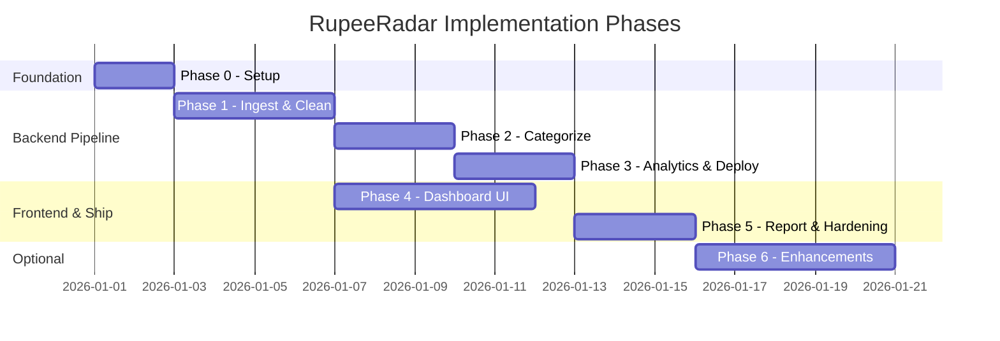
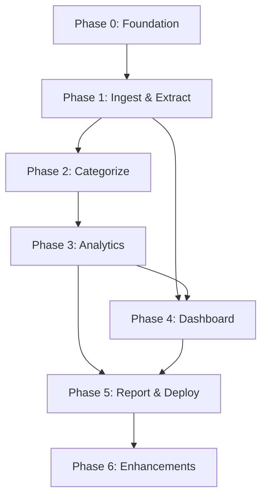

# RupeeRadar — Phase-Wise Implementation Plan

This plan translates [architecture.md](./architecture.md) into a build sequence optimized for a **working end-to-end prototype**. Each phase has clear deliverables, acceptance criteria, and dependencies.

**Estimated total duration:** 3–4 weeks (solo developer, part-time) or 1.5–2 weeks (full-time).

---

## Plan Overview



| Phase | Name | Outcome |
|-------|------|---------|
| 0 | Project foundation | Runnable monorepo, API skeleton, dev tooling |
| 1 | Ingestion & extraction | CSV → cleaned `Transaction` list via API |
| 2 | Categorization | Rule + LLM hybrid tagging with confidence |
| 3 | Analytics & deployment | Recurring detection, metrics, insights, and cloud deployment (Railway & Vercel) |
| 4 | Dashboard UI | Upload → full visual summary in browser |
| 5 | Report & hardening | PDF/HTML export, Docker, session expiry, security |
| 6 | Enhancements (optional) | Excel/PDF, overrides, LLM polish |

> **Parallelization tip:** Phase 4 can start once Phase 1 API contracts are stable; wire real data as Phases 2–3 complete.

---

## Phase 0 — Project Foundation

**Goal:** Establish repo structure, tooling, shared models, and a health-check API both apps can call.

**Duration:** 1–2 days

### Tasks

| # | Task | Details |
|---|------|---------|
| 0.1 | Initialize monorepo | Create `rupeeradar/` with `apps/web`, `apps/api`, `docs/` |
| 0.2 | Scaffold FastAPI backend | `main.py`, CORS, `/health`, env loading |
| 0.3 | Scaffold Next.js frontend | App router, Tailwind, basic layout shell |
| 0.4 | Define shared types | Pydantic models mirroring architecture §5 (`Transaction`, `Category`, etc.) |
| 0.5 | SQLite session store | Tables: `sessions`, `session_status`; UUID session IDs |
| 0.6 | Docker Compose | `web:3000`, `api:8000`, volume for SQLite + temp uploads |
| 0.7 | Sample data | 1–2 sample CSV bank statements for local testing |
| 0.8 | README | Setup, run commands, env vars |

### Deliverables

- `docker compose up` starts both services
- `GET /health` returns `{ "status": "ok" }`
- Frontend loads landing page with RupeeRadar branding

### Acceptance criteria

- [ ] Backend and frontend communicate (frontend calls `/health`)
- [ ] Environment variables documented (`.env.example`)
- [ ] No secrets committed to repo

### Key files

```
apps/api/main.py
apps/api/models/transaction.py
apps/api/db/session_store.py
apps/web/app/page.tsx
apps/web/lib/api.ts
docker-compose.yml
.env.example
```

---

## Phase 1 — Ingestion & Extraction Pipeline

**Goal:** Accept CSV upload, parse and clean transactions, expose via REST.

**Duration:** 3–4 days  
**Depends on:** Phase 0

### Tasks

| # | Task | Details |
|---|------|---------|
| 1.1 | Session API | `POST /sessions`, `DELETE /sessions/{id}` |
| 1.2 | Upload endpoint | `POST /sessions/{id}/upload` — validate MIME, size (e.g., 10 MB max) |
| 1.3 | Format detection | Extension + MIME; CSV delimiter/header sniffing |
| 1.4 | Column mapping heuristics | Match `date`, `description`, `debit`, `credit`, `amount` column names |
| 1.5 | Column mapping fallback | Return detected schema + allow manual mapping JSON in request |
| 1.6 | CSV parser | pandas read → raw row list |
| 1.7 | Extraction service | Date normalize, amount sign, description trim |
| 1.8 | Deduplication | Hash `(date, amount, normalized_description)` |
| 1.9 | Merchant extraction | Strip UPI/IMPS noise; extract merchant token |
| 1.10 | Pipeline orchestrator | `POST /sessions/{id}/analyze` — run ingest → extract (stub later stages) |
| 1.11 | Status endpoint | `GET /sessions/{id}/status` — `pending | processing | complete | error` |
| 1.12 | Transactions endpoint | `GET /sessions/{id}/transactions` — paginated, filterable |

### Deliverables

- Upload a CSV → receive cleaned transaction JSON
- Invalid rows skipped with count in response metadata

### Acceptance criteria

- [ ] Parses sample CSV with 100+ transactions in &lt;5 seconds
- [ ] Dates normalized to ISO `YYYY-MM-DD`
- [ ] Amounts: debits negative, credits positive
- [ ] Duplicate transactions removed
- [ ] Upload rejects unsupported file types with clear error
- [ ] Temp files stored under session-scoped directory; deleted on session delete

### Key files

```
apps/api/routers/sessions.py
apps/api/services/ingestion/detector.py
apps/api/services/ingestion/csv_parser.py
apps/api/services/extraction/cleaner.py
apps/api/services/extraction/merchant.py
apps/api/services/pipeline/orchestrator.py
```

### Test cases (manual)

| Input | Expected |
|-------|----------|
| Valid CSV | 100% rows parsed (minus header) |
| Missing date column | 400 + mapping UI hint |
| Mixed date formats | All parsed correctly |
| Duplicate rows | Deduped count reflected |

---

## Phase 2 — Categorization Module

**Goal:** Assign each transaction a category with confidence score using rules first, LLM fallback.

**Duration:** 2–3 days  
**Depends on:** Phase 1

### Tasks

| # | Task | Details |
|---|------|---------|
| 2.1 | Category enum | 10 categories per architecture §5.4 |
| 2.2 | Rules engine | Keyword/regex map in `rules/categories.yaml` or `.json` |
| 2.3 | Rule matcher | Case-insensitive match on `cleanDescription` + `merchant` |
| 2.4 | Confidence scoring | Rules → 0.9; partial match → 0.7 |
| 2.5 | LLM client | OpenAI/Gemini/Ollama abstraction with env-based provider |
| 2.6 | Batch categorizer | 20–50 tx per prompt; JSON response schema |
| 2.7 | Description cache | Hash → category within session to reduce API calls |
| 2.8 | Fallback logic | LLM failure → `Other` with confidence 0.3 |
| 2.9 | Wire into pipeline | Extract → Categorize step in orchestrator |
| 2.10 | Categories endpoint | `GET /sessions/{id}/categories` — aggregated spend per category |
| 2.11 | Override endpoint | `PATCH /sessions/{id}/transactions/{txId}` — user correction |
| 2.12 | Session rule learning | On override, add merchant → category to session rules |

### Deliverables

- Categorized transaction list with `category`, `categoryConfidence`, `categorySource`
- Category aggregation API

### Acceptance criteria

- [ ] ≥80% of sample transactions categorized by rules alone (no LLM)
- [ ] LLM fills remaining uncategorized/low-confidence items
- [ ] LLM timeout does not fail pipeline; falls back gracefully
- [ ] User override persists and re-applies to matching merchants in session
- [ ] Categories endpoint returns amounts and percentages

### Key files

```
apps/api/rules/categories.yaml
apps/api/services/categorization/rules_engine.py
apps/api/services/categorization/llm_categorizer.py
apps/api/services/categorization/service.py
```

### Rule seed list (minimum)

Include at least 5 keywords per category from architecture §4.5 (SWIGGY, IRCTC, AMAZON, JIO, NETFLIX, NACH, SALARY, RENT, ZERODHA, etc.).

---

## Phase 3 — Analytics Pipeline & Deployment (Railway & Vercel)

**Goal:** Complete backend pipeline with financial metrics and ≥3 insights, and deploy the application (FastAPI backend to Railway, Next.js frontend to Vercel).

**Duration:** 2–3 days  
**Depends on:** Phase 2

### Tasks

#### 3A — Recurring Detection

| # | Task | Details |
|---|------|---------|
| 3.1 | Fingerprint grouping | Group by normalized merchant/description |
| 3.2 | Occurrence filter | Groups with ≥2 transactions |
| 3.3 | Amount variance check | ±5% tolerance |
| 3.4 | Interval detection | Monthly (±3 days), weekly, quarterly |
| 3.5 | Type classification | subscription, emi, rent, sip, insurance, other |
| 3.6 | Recurring endpoint | `GET /sessions/{id}/recurring` |
| 3.7 | Tag transactions | Set `isRecurring`, `recurringGroupId` on matched tx |

#### 3B — Metrics Engine

| # | Task | Details |
|---|------|---------|
| 3.8 | Summary calculator | Income, spend, savings, savings rate |
| 3.9 | Top categories | Sorted with percentages |
| 3.10 | Biggest transaction | Largest debit |
| 3.11 | Monthly aggregation | Spend by calendar month |
| 3.12 | Recurring total | Sum of monthly equivalents |
| 3.13 | Summary endpoint | `GET /sessions/{id}/summary` |
| 3.14 | Period filter | Query param: `?from=&to=` for date range |

#### 3C — Insight Generator

| # | Task | Details |
|---|------|---------|
| 3.15 | Template engine | Top category, biggest purchase, recurring burden, savings rate, month comparison |
| 3.16 | Insight ranking | Pick top 3–5 by relevance (always ≥3) |
| 3.17 | Insights endpoint | `GET /sessions/{id}/insights` |
| 3.18 | Optional LLM polish | Rewrite template strings if API key present |

#### 3D — Deployment Configuration (Railway & Vercel)

| # | Task | Details |
|---|------|---------|
| 3.19 | Backend CORS configuration | Update FastAPI (`apps/api/main.py`) to accept dynamic origins via `CORS_ALLOWED_ORIGINS` env var (supporting the Vercel deployment URL) |
| 3.20 | Environment configuration | Add `DATABASE_URL` setup to support Railway's Postgres or persistent disk path, configure Groq API Key and health checks |
| 3.21 | Frontend API integration | Ensure the Next.js API client reads the target API domain from environment variables (`NEXT_PUBLIC_API_URL`) |
| 3.22 | Railway backend deployment | Deploy `apps/api` using Dockerfile or Nixpacks on Railway; set environment variables |
| 3.23 | Vercel frontend deployment | Deploy `apps/web` on Vercel; configure `NEXT_PUBLIC_API_URL` environment variable |

### Deliverables

- Full `POST /analyze` runs all stages end-to-end
- Summary, recurring, and insights APIs populated
- Live backend API deployed on Railway
- Live frontend dashboard deployed on Vercel

### Acceptance criteria

- [ ] Detects known recurring items in sample data (e.g., Netflix, rent, EMI)
- [ ] Summary math matches manual calculation on sample CSV
- [ ] At least 3 insights returned with real ₹ amounts
- [ ] Empty/recurring-less statements return helpful messages, not errors
- [ ] Full pipeline completes in &lt;30 seconds for 500 transactions (rules-only)
- [ ] API is running on Railway and returns `{ "status": "ok" }` on `/health`
- [ ] Next.js app is deployed on Vercel and successfully communicates with the Railway API in the cloud environment

### Key files

```
apps/api/services/recurring/detector.py
apps/api/services/metrics/calculator.py
apps/api/services/insights/templates.py
apps/api/services/insights/generator.py
apps/api/main.py
apps/web/lib/api.ts
```

---

## Phase 4 — Dashboard UI

**Goal:** Browser-based upload and visualization of all analysis results.

**Duration:** 4–5 days  
**Depends on:** Phase 1 (can mock data initially); Phase 3 for full integration

### Tasks

| # | Task | Details |
|---|------|---------|
| 4.1 | Upload page | Drag-and-drop, file picker, format hints, privacy notice |
| 4.2 | API client | Typed wrappers for all `/api/v1/sessions/*` endpoints |
| 4.3 | Upload flow | Create session → upload → analyze → poll status |
| 4.4 | Loading states | Progress indicator during analysis |
| 4.5 | Error handling | User-friendly messages per architecture §6 failure modes |
| 4.6 | Overview view | Income, spend, savings cards; period display |
| 4.7 | Categories view | Pie/bar chart (Recharts) + category table |
| 4.8 | Transactions view | Searchable table; category badge; sort by date/amount |
| 4.9 | Recurring view | List with type, amount, frequency, monthly total |
| 4.10 | Insights view | ≥3 insight cards with title, body, amount |
| 4.11 | Navigation | Tab or sidebar: Overview / Categories / Transactions / Recurring / Insights |
| 4.12 | Category override UI | Dropdown on transaction row → PATCH endpoint |
| 4.13 | Responsive layout | Usable on laptop and tablet widths |
| 4.14 | Empty states | Guidance when no data or no recurring found |
| 4.15 | Delete session | Button to purge data (`DELETE /sessions/{id}`) |

### Deliverables

- Single-page or multi-tab dashboard after upload
- Complete demo flow without curl/Postman

### Acceptance criteria

- [ ] User can upload CSV and see dashboard without developer tools
- [ ] All 5 dashboard sections render real API data
- [ ] Charts reflect category aggregates correctly
- [ ] Category override updates UI and persists on refresh
- [ ] Privacy notice visible on upload screen
- [ ] Mobile-friendly layout (not broken on narrow screens)

### Key files

```
apps/web/app/page.tsx                    # Upload landing
apps/web/app/dashboard/[sessionId]/page.tsx
apps/web/components/upload/DropZone.tsx
apps/web/components/dashboard/SummaryCards.tsx
apps/web/components/dashboard/CategoryChart.tsx
apps/web/components/dashboard/TransactionTable.tsx
apps/web/components/dashboard/RecurringList.tsx
apps/web/components/dashboard/InsightCards.tsx
apps/web/lib/api.ts
```

### UI wireframe (logical)

```
┌─────────────────────────────────────────────────────┐
│  RupeeRadar          [Delete Session]               │
├──────────┬──────────────────────────────────────────┤
│ Overview │  Income ₹X   Spend ₹Y   Savings ₹Z        │
│ Categories│  [Pie Chart]  [Bar Chart]               │
│ Transactions│  [Searchable Table]                   │
│ Recurring │  [Recurring Items List]                 │
│ Insights  │  [Insight Card] [Insight Card] [+]      │
└──────────┴──────────────────────────────────────────┘
```

---

## Phase 5 — Report Export & Production Hardening

**Goal:** Shareable report, session security, auto-expiry, and final documentation.

**Duration:** 2–3 days  
**Depends on:** Phases 3 and 4

### Tasks

| # | Task | Details |
|---|------|---------|
| 5.1 | Report template | HTML layout with summary, charts-as-tables, insights |
| 5.2 | Report endpoint | `GET /sessions/{id}/report?format=html|pdf` |
| 5.3 | PDF generation | WeasyPrint (backend) or browser print (frontend fallback) |
| 5.4 | Report UI | Download button + print-friendly `/report` page |
| 5.5 | Session TTL | Auto-expire sessions after 24h (background job or lazy cleanup) |
| 5.6 | Security hardening | File size limits, sanitized filenames, no raw data in logs |
| 5.7 | Docker production config | Multi-stage builds, non-root user |
| 5.8 | Production deployment sync | Synchronize Railway (backend) and Vercel (frontend) deployments with the finalized report and routing logic |
| 5.9 | Demo script | Step-by-step for judges: upload → dashboard → report |
| 5.10 | Final README | Architecture link, screenshots, env setup, limitations |

### Deliverables

- Downloadable HTML/PDF report
- One-command local run + verified live URL (Railway + Vercel)

### Acceptance criteria

- [ ] Report includes summary, top categories, recurring list, ≥3 insights
- [ ] Report usable without JavaScript (HTML export)
- [ ] `docker compose up` works on fresh clone
- [ ] Session auto-expiry or manual delete documented
- [ ] Demo completable in &lt;3 minutes

### Key files

```
apps/api/services/report/generator.py
apps/api/templates/report.html
apps/web/app/dashboard/[sessionId]/report/page.tsx
Dockerfile (web + api)
docs/demo-script.md
```

---

## Phase 6 — Enhancements (Optional / Post-MVP)

**Goal:** Improve robustness and evaluation scores beyond minimum deliverable.

**Duration:** 3–5 days  
**Depends on:** Phase 5

### Tasks (pick by priority)

| Priority | Task | Details |
|----------|------|---------|
| P1 | Excel support | `.xlsx` via openpyxl; sheet auto-detection |
| P1 | Column mapping UI | Frontend modal when heuristics fail |
| P2 | PDF bank statements | pdfplumber/table extraction for one bank template |
| P2 | LLM insight polish | Natural-language rewrite of template insights |
| P2 | Period selector | Filter dashboard by month / custom range |
| P3 | Ollama local mode | No data leaves machine; document in README |
| P3 | Confidence UI | Highlight low-confidence categories for review |
| P3 | Internal transfer detection | Exclude self-transfers from spend totals |

### Acceptance criteria (if pursued)

- [ ] Second file format (Excel or PDF) works end-to-end
- [ ] Column mapping UI resolves ambiguous CSV headers without code changes

---

## Cross-Phase Checklist (MVP Definition)

Use this to confirm challenge deliverable completeness before submission:

| Requirement (from context.md) | Phase |
|-------------------------------|-------|
| Accept bank statement data | 1 |
| Extract/clean structured transactions | 1 |
| Categorize into 10 categories | 2 |
| Detect recurring payments | 3 |
| Calculate income, spend, savings, top categories | 3 |
| Generate human-readable insights (≥3) | 3 |
| Dashboard / UI | 4 |
| Shareable report | 5 |
| Privacy-conscious session handling | 0, 1, 5 |

---

## Dependency Graph



---

## Risk Mitigation

| Risk | Mitigation | Phase |
|------|------------|-------|
| Messy CSV formats | Start with one bank template + generic fallback; add mapping UI in Phase 6 | 1, 6 |
| LLM cost/latency | Rules-first; batch calls; description cache | 2 |
| LLM API failure | Template-only insights; rules-only categorization | 2, 3 |
| PDF parsing complexity | Defer to Phase 6; CSV-first for MVP | 1, 6 |
| Scope creep | Strict MVP checklist; Phase 6 is explicitly optional | All |
| Privacy concerns | Ephemeral sessions, delete endpoint, privacy notice | 0, 1, 4, 5 |

---

## Suggested Weekly Schedule (Full-Time)

| Week | Focus | Milestone |
|------|-------|-----------|
| Week 1 | Phases 0–1 | Upload CSV → cleaned transactions via API |
| Week 2 | Phases 2–3 | Full backend pipeline with insights |
| Week 3 | Phase 4 | Working dashboard |
| Week 4 | Phase 5 (+ Phase 6 if time) | Deployed demo + report export |

---

## References

- [context.md](./context.md) — Product requirements
- [architecture.md](./architecture.md) — System design and API contracts
- [problemStatement.txt](./problemStatement.txt) — AI Challenge brief
